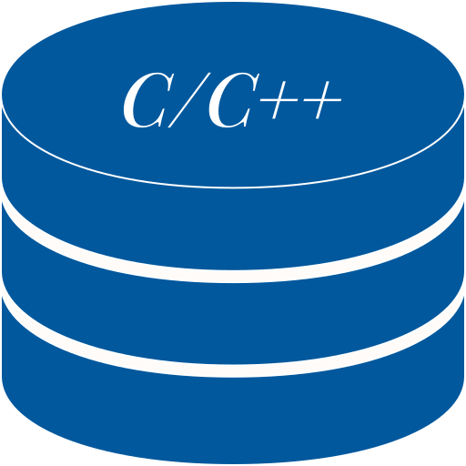
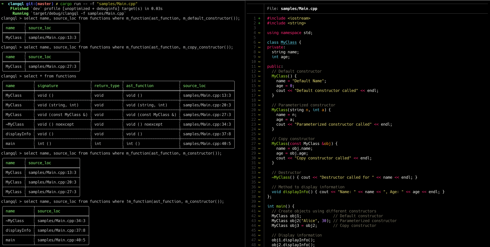

<h1 align="center">ClangQL - Clang AST Query Language</h1></br>

<p align="center">

</p>

<p align="center">
  
  
  
  
</p>

<p align="center">
ClangQL is a tool that allow you to run SQL-like query on C/C++ Code instead of database files using the GitQL SDK.
</p>

<p align="center">
  
</p>

---

### Samples

Note that all Keywords in ClangQL are case-insensitive, similar to SQL.

```sql
SELECT 1
SELECT 1 + 2
SELECT LEN("Clang Query Language")
SELECT "One" IN ("One", "Two", "Three")
SELECT "Clang Query Language" LIKE "%Query%"

SELECT * FROM functions
SELECT COUNT(name) from functions WHERE return_type = "int"
SELECT DISTINCT name AS function_name FROM functions
```

---

### Functions table structure

| Name            | Type    | Description                                                                                                                                                         |
| --------------- | ------- | ------------------------------------------------------------------------------------------------------------------------------------------------------------------- |
| name            | Text    | Function or Method name                                                                                                                                             |
| signature       | Text    | Parameters and return type literal                                                                                                                                  |
| args_count      | Integer | Number of arguments                                                                                                                                                 |
| class_name      | Text    | Return class name for method                                                                                                                                        |
| return_type     | Text    | Return type literal                                                                                                                                                 |
| is_method       | Boolean | True if it's a method                                                                                                                                               |
| is_virtual      | Boolean | Return true if a C++ member function or member function template is  explicitly declared 'virtual' or if it overrides a virtual method from one of the base classes |
| is_pure_virtual | Boolean | Return ture if a C++ member function or member function template is pure virtual                                                                                    |
| is_static       | Boolean | Return ture if a C++ member function is static                                                                                                                      |
| is_const        | Boolean | Return ture if a C++ member function is const                                                                                                                       |
| has_template    | Boolean | True if it's has template                                                                                                                                           |
| access_modifier | Integer | Returns the access control level for method, 1 for public, 2 protected, 3 provide, 0 for invalid                                                                    |
| is_variadic     | Boolean | True if function type is variadic                                                                                                                                   |

---

### Download or Install

Note that Building from source or installing from Cargo.io requires LibClang 17 to be installed

- Install from Cargo.io

```
cargo install clangql
```

- Build from source code

```
git clone https://github.com/AmrDeveloper/clangql.git
cd clangql
cargo build
```

### Run ClangQL

```
ClangQL is a SQL like query language to run on local files
Usage: ClangQL [OPTIONS]

Options:
  -f,  --files <paths>        Path for local files to run query on
  -q,  --query <GQL Query>    ClangQL query to run on selected files
  -p,  --pagination           Enable print result with pagination
  -ps, --pagesize             Set pagination page size [default: 10]
  -o,  --output               Set output format [render, json, csv]
  -a,  --analysis             Print Query analysis
  -h,  --help                 Print ClangQL help
  -v,  --version              Print ClangQL Current Version
```

### License
```
MIT License

Copyright (c) 2024 Amr Hesham

Permission is hereby granted, free of charge, to any person obtaining a copy
of this software and associated documentation files (the "Software"), to deal
in the Software without restriction, including without limitation the rights
to use, copy, modify, merge, publish, distribute, sublicense, and/or sell
copies of the Software, and to permit persons to whom the Software is
furnished to do so, subject to the following conditions:

The above copyright notice and this permission notice shall be included in all
copies or substantial portions of the Software.

THE SOFTWARE IS PROVIDED "AS IS", WITHOUT WARRANTY OF ANY KIND, EXPRESS OR
IMPLIED, INCLUDING BUT NOT LIMITED TO THE WARRANTIES OF MERCHANTABILITY,
FITNESS FOR A PARTICULAR PURPOSE AND NONINFRINGEMENT. IN NO EVENT SHALL THE
AUTHORS OR COPYRIGHT HOLDERS BE LIABLE FOR ANY CLAIM, DAMAGES OR OTHER
LIABILITY, WHETHER IN AN ACTION OF CONTRACT, TORT OR OTHERWISE, ARISING FROM,
OUT OF OR IN CONNECTION WITH THE SOFTWARE OR THE USE OR OTHER DEALINGS IN THE
SOFTWARE.
```
